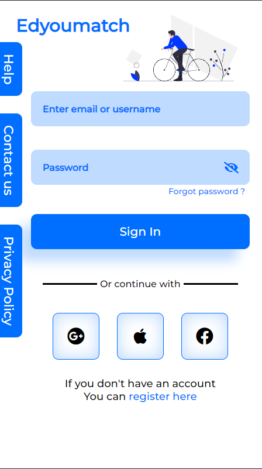

# **Edyoumatch**

#### EdYouMatch is an educational Progressive web app (PWA) built using the current techs, it contains various packages and features built from scratch like Swiping and responsive design. Also, it contains features like chatting, sending connections, etc. The course section is an upcoming feature for this application.

## **Features**

- Surf educational posts ont the explore tab
- Maintain your educational profile
- Apply for various educational loans and scholarships
- Chat with peoples
- Buy on-demand courses offered by variuos colleges.
- Responsive design (Mobile & Desktop)

## **Signup/Login pages**

- Register and verify your account.
- An email will be automatically sent for verification.
- Login to explore various education posts and courses.

## **Explore Tab**

- Swiping Feature implemented from scratch using vanilla JS.
- Swiping Right save the post in Saved Interest section for future reviews.
- Swiping left indicates not interested in that post and move forward.
- Post have a status type implementation to move through various images of the post.
- Click or touch left on post to move to leftmost image.
- Click or touch right on post to move to rightmost image.
- Additionally a more details sections, regarding the post.

## **Profile Section**

- Customize your profile.
- Add interests to get posts according to interested domain.
- Change profile pic by clicking on the image avatar and select a new image from file explorer.
- Manage your account changing password, deactivating account, deleting account etc.

## **Scholarships & loans pages**

- Explore various scholarships and educational loans offered by various universities accross the world.

## **Chats**

- Chat with your connections.
- Get in contact with university peoples through connections.
- Share Post with other peoples, get reviews.

## **Home- Course Section (Upcoming feature)**

- Explore courses offered by the colleges & universities.
- Buy Courses and start your learning.

